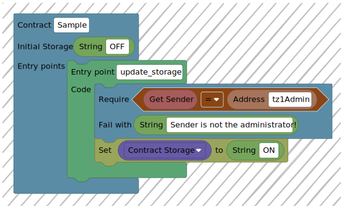

# VisualTez (Work in Progress)

`VisualTez` is a visual programming tool for writing smart contracts in the Tezos blockchain.

[Basic Demo](https://visualtez.com)

| Project repos |
|:-:|
| [SmartTS SDK  ](https://github.com/RomarQ/smartts-sdk) |
| [Michelson SDK](https://github.com/RomarQ/michelson-sdk) |
| [Infrastructure Automation](https://github.com/RomarQ/VisualTez-infra) |
